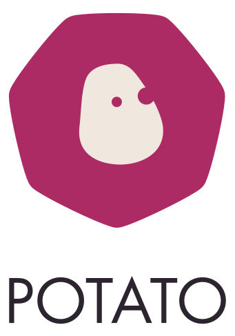

### UPDATE @ 11:15 2016-07-23

The doors are closed. If you're late then:

* Press the door buzzer for Potato
* call [@r4vi] on 07742340431 
* @ us in the [chat]

and someone will come and let you in.

### UPDATE @ 11:00 2016-07-23

We have two groups of people attending: makers and spectators.

Makers will be admitted starting at 10AM. You'll have plenty of time to finish up your project and make it presentable.

The rest (spectators) will come in at 4PM - snacks and drinks will be served and you'll have some time to mingle if you're done hacking.

We'll start demos at 6PM - everyone will have at least 5 minutes to present their end result. We expect this to take around two hours.

Depending on what people will feel like, we'll move to a nearby pub at around 8PM.

#### CHAT
We have a [discord room][chat] if you want to chat to fellow hackers: https://discord.gg/RzwymGC

## WHAT

A hackathon dedicated to creating things that have absolutely no value.

## WHY

Because the stuff you do at work isn't pointless enough.

## WHEN

July 23rd, 2016 (Saturday)

## WHERE

Potato London  
The Network Building  
97 Tottenham Court Road  
London W1T 4TP  

## HOW

Get your ticket via the form below:

<tito-widget event="stupid-hackathon-london/2016">
</tito-widget>

## THEMES

  * MARGINALLY MORE EFFICIENT FOOD DELIVERY
  * PUT SOME SENSORS ON IT
  * PENTA-COPTORS
  * DEPRESSED CHATBOTS
  * INTERNET OF USELESS THINGS
  * EMOJIANAL INTELLIGENCE
  * SMALL BATCH SINGLE ESTATE ARTISANAL DATA
  * BURRITO X-PRIZE
  * "APIS"
  * "APPS"

## ELSEWHERE

 * [New York](http://www.stupidhackathon.com) (the original)
 * [Berlin](http://stupidhackathon.de/)
 * [Toronto](http://stupidhacktoronto.com/)
 * [San Francisco](https://stupidhackathon.github.io/)

## SPONSORS

<a href="https://p.ota.to/"></img></a>

## CONTACT

tweet us [@stupidhackuk](https://twitter.com/stupidhackuk) or email at: [help@stupidhackathon.uk](mailto:help@stupidhackathon.uk)

## WHO RUNS THIS?

Jan Szumiec ([@jasiek_](https://twitter.com/jasiek_)) and Ravi Kotecha ([@r4vi]).

## CONDUCT

### The Quick Version

Our event is dedicated to providing a harassment-free event experience for everyone, regardless of gender, 
gender identity and expression, age, sexual orientation, disability, 
physical appearance, body size, race, ethnicity, religion (or lack thereof), or technology choices. 
We do not tolerate harassment of event participants in any form. 

Event participants violating these rules may be expelled from the event without at the discretion of the event organisers.

### The Less Quick Version

Harassment includes offensive verbal comments related to gender, gender identity and expression, age, sexual orientation, disability, physical appearance, body size, race, ethnicity, religion, technology choices, sexual images in public spaces, deliberate intimidation, stalking, following, harassing photography or recording, sustained disruption of talks or other events, inappropriate physical contact, and unwelcome sexual attention.

Participants asked to stop any harassing behavior are expected to comply immediately.

If a participant engages in harassing behavior, the event organisers may take any action they deem appropriate, including warning the offender or expulsion from the event with no refund.

If you are being harassed, notice that someone else is being harassed, or have any other concerns, please contact an organiser immediately. 

Event staff will be happy to help participants contact hotel/venue security or local law enforcement, provide escorts, or otherwise assist those experiencing harassment to feel safe for the duration of the event. 
We value your attendance.

## HOW DO I RUN ONE?

Wanna run your own? We're not a centralized organization, 
just a group of friends in London who were appalled it didn't already have a Stupid Hackathon. 
You're welcome to steal the idea for your city.

<a
  title="Gregor Hohenberg (Courtesy of Barbara Buchholz) [CC BY-SA 3.0 (http://creativecommons.org/licenses/by-sa/3.0)], via Wikimedia Commons" 
  href="https://commons.wikimedia.org/wiki/File%3ABarbara_Buchholz_playing_TVox.jpg"
  class="small-link"
>
  photo by Gregor Hohenberg
</a>

Made with <a href="https://github.com/gatsbyjs/">Gatsby</a> a React.js static site generator.

[chat]: https://discord.gg/RzwymGC
[@r4vi]: https://twitter.com/r4vi
